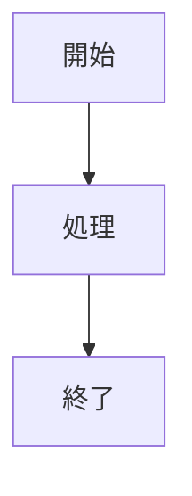

# ブログ執筆ガイド

このドキュメントは、yolos.net のブログ記事を執筆する際のガイドラインです。

---

## フロントマター

ブログ記事は Markdown ファイルのフロントマターに記事のメタデータを記述します。

```yaml
---
title: "記事タイトル"
slug: "article-slug"
description: "記事の説明（検索結果やOGPに使用）"
published_at: "2026-01-01T00:00:00+09:00"
updated_at: null
tags: ["タグ1", "タグ2"]
category: "カテゴリ名"
series: null
series_order: null
trust_level: "generated"
---
```

### 必須フィールド

| フィールド     | 説明                                                           |
| -------------- | -------------------------------------------------------------- |
| `title`        | 記事タイトル                                                   |
| `slug`         | URLスラッグ（英数字とハイフンのみ）                            |
| `description`  | 記事の説明（SEO・OGP用）                                       |
| `published_at` | 公開日時（ISO 8601形式）                                       |
| `trust_level`  | コンテンツの信頼レベル（`generated` / `curated` / `verified`） |

### オプションフィールド

| フィールド     | 説明                       |
| -------------- | -------------------------- |
| `updated_at`   | 更新日時（null可）         |
| `tags`         | タグ配列                   |
| `category`     | カテゴリ                   |
| `series`       | シリーズ名（null可）       |
| `series_order` | シリーズ内の順序（null可） |

---

## Markdown 記法

### 見出し

```markdown
## H2 見出し（記事内の大セクション）

### H3 見出し（サブセクション）

#### H4 見出し（小見出し）
```

> [!NOTE]
> H1（`#`）は記事タイトルが自動的に使用されるため、記事本文では H2（`##`）から使用してください。

### リスト

```markdown
- 箇条書き1
- 箇条書き2
  - ネスト

1. 番号付きリスト
2. 項目2
```

### コードブロック

言語を指定することでシンタックスハイライトが適用されます。

````markdown
```typescript
const greeting = "Hello, World!";
console.log(greeting);
```
````

### Mermaid 図表

コードブロックの言語を `mermaid` にすることで図表を描画できます。

````markdown

````

### テーブル

```markdown
| 列1   | 列2   | 列3   |
| ----- | ----- | ----- |
| セル1 | セル2 | セル3 |
| セル4 | セル5 | セル6 |
```

---

## Admonition（補足ボックス）記法

GFM Alert 構文を使用して、5種類の補足ボックスを追加できます。
この記法は GitHub および GitLab でも同様に表示されます。

### 基本構文

```markdown
> [!TYPE]
> ボックスの内容をここに書きます。
> 複数行書くこともできます。
```

### 5種類のバリアント

#### Note（青）— 補足情報

```markdown
> [!NOTE]
> 読者に知っておいてほしい追加情報や補足事項です。
```

> [!NOTE]
> 読者に知っておいてほしい追加情報や補足事項です。

#### Tip（緑）— ヒント・コツ

```markdown
> [!TIP]
> 作業をより効率的に進めるためのヒントや推奨事項です。
```

> [!TIP]
> 作業をより効率的に進めるためのヒントや推奨事項です。

#### Important（紫）— 重要情報

```markdown
> [!IMPORTANT]
> 目標を達成するために不可欠な重要情報です。見逃さないようにしてください。
```

> [!IMPORTANT]
> 目標を達成するために不可欠な重要情報です。見逃さないようにしてください。

#### Warning（黄）— 注意・警告

```markdown
> [!WARNING]
> 問題を引き起こす可能性がある操作や設定についての警告です。
```

> [!WARNING]
> 問題を引き起こす可能性がある操作や設定についての警告です。

#### Caution（赤）— 危険・エラー

```markdown
> [!CAUTION]
> 取り返しのつかない結果を招く可能性がある操作です。慎重に行ってください。
```

> [!CAUTION]
> 取り返しのつかない結果を招く可能性がある操作です。慎重に行ってください。

### 使いどころのガイドライン

| バリアント  | 使うタイミング                                   |
| ----------- | ------------------------------------------------ |
| `NOTE`      | 追加情報、補足説明、前提条件の説明               |
| `TIP`       | 便利なショートカット、推奨の手順、効率化のコツ   |
| `IMPORTANT` | 必ず確認すべき設定、インストール前提条件         |
| `WARNING`   | データ損失の可能性、動作の変化、非推奨の手順     |
| `CAUTION`   | 削除・初期化などの不可逆な操作、本番環境への影響 |

### 注意事項

- Admonition は読者の注意を引く補足情報に使用してください。乱用すると効果が薄れます
- 1記事につき多くても4〜5個を目安にしてください
- Admonition 内に見出しや他のAdmonitionをネストするのは避けてください
- 通常の引用（`> テキスト`）はAdmonitionに変換されません

---

## 記事品質基準

記事の品質基準については [docs/content-quality-requirements.md](./content-quality-requirements.md) を参照してください。

記事を公開する前に以下を確認してください。

- [ ] タイトルと説明（description）が記事の内容を正確に表している
- [ ] 記事の価値が最初の段落で明確に伝わる
- [ ] コードブロックに言語指定がある
- [ ] 外部リンクは適切な場所を参照している
- [ ] Admonitionの使用が適切（乱用していない）

---

## 更新履歴

| 日付       | 内容                                                |
| ---------- | --------------------------------------------------- |
| 2026-03-01 | 初版作成。admonition記法（GFM Alert構文）の説明含む |
